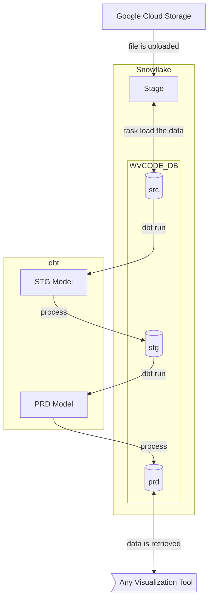

# data-repo-snow

Este repositório contém datasets para estudo de visualização de dados. Os dados estão armazenados em um data warehouse Snowflake. A modelagem dos datasets foi feita utilizando dbt.

## Objetivo

O objetivo do repositório é servir como um item de portfolio para demonstrar habilidades em modelagem de dados e análise de dados utilizando o data warehouse SnowFlake. Nas próximas seções, iremos descrever o que foi feito neste repositório.

## Arquitetura do Projeto

Este projeto é um projeto tradicional de data warehouse, onde contemplamos os processos de extração, carga e transformação (paradigma ELT), gerando ao final tabelas prontas para serem utilizadas por analistas para produzir visualizações. 

O projeto estruturou o warehouse em 3 camadas, conforme o padrão ***Medallion Architecture***:
- **src (Bronze)**: onde os dados são carregados diretamente dos arquivos, sem nenhuma transformação
- **stg (Silver)**: onde os dados são tratados e transformados, mas ainda não estão prontos para serem consumidos
- **prd (Gold)**: onde os dados estão prontos para serem consumidos

Utilizamos a ferramenta dbt para fazer a transformação dos dados, garantindo que todo o nosso projeto é baseado em código SQL, o que nos permite versionar o código e garantir a qualidade do mesmo.

A arquitetura pode ser visualizada no diagrama abaixo:

## Tecnologias utilizadas

Foram utilizadas as seguintes tecnologias:
- Data Warehouse Snowflake, para armazenamento dos dados
- Snowflake Scripting, para criação de procedures, tasks e stages
- dbt (versão 1.8.3), para modelagem dos dados, utilizando o componente dbt-core e dbt-snowflake
- Python, para poder utilizar o dbt
- Github, para armazenar o código
- Google Cloud Storage, para armazenar temporariamente os datasets em arquivos, para carga no warehouse

## Snowflake - Setup e Detalhes de Implementação

O data warehouse foi configurado da seguinte forma:
- Um warehouse chamado WVCODE_WH, com tamanho X-Small, para processamento de tasks, procedures e queries
- Um banco de dados chamado WVCODE_BD com 4 schemas:
  - public: para armazenar procedures, stages, tasks e outros objetos
  - src: para representar a camada bronze
  - stg: para representar a camada silver
  - prd: para representar a camada gold

Tendo essa configuração básica, vamos aos detalhes de implementação. Os scripts de criação dos objetos estão na pasta `sf_scripts`.

### Stage WVCODE_STAGE

Criamos no schema public um External Stage que se conecta ao Google Cloud Storage, onde fazemos upload dos arquivos.

### Task Load_File_Task

Criamos uma task que é executada a cada 30 minutos, chamando uma procedure que identifica se um arquivo está presente no stage, e então, faz as inferência da estrutura de dados do arquivo, cria a tabela correspondente no schema src e carrega os dados. Se a execução ocorrer sem erros, o arquivo é removido da stage.

### File Format WVCODE_CSV e WVCODE_CSV_0

Criamos dois file formats, um para arquivos CSV com cabeçalho e outro para arquivos CSV sem cabeçalho. O formato com cabeçalho é utilizado para inferir a estrutura dos arquivos, enquanto o formato sem cabeçalho é utilizado para carregar os dados.

## dbt - Setup e Detalhes de Implementação

O dbt foi utilizado para modelagem dos dados. O dbt é uma ferramenta de modelagem de dados open-source que permite analistas e engenheiros de dados transformar dados em insights. O dbt permite que você escreva transformações SQL em arquivos .sql e depois rodar esses arquivos para criar tabelas e views no seu data warehouse.

Utilizamos a estrutura padrão de projeto, e fizemos algumas configurações adicionais para que o mesmo pudesse ser armazenado no github. Veja a seguir as configurações feitas:

### Macro generate_schema_name

Criamos esta macro para garantir que o schema default da configuração da conexão não será adicionado como prefixo aos schemas que foram criados de acordo com o padrão de projeto.

### Arquivo de Conexão profiles.yml

Criamos um arquivo de conexão profiles.yml para armazenar as informações de conexão com o Snowflake. Este arquivo utiliza variáveis de ambiente que devem estar presentes em um arquivo .env.

## Contato

Para mais informações, entre em contato comigo pelo email: [Walter](mailto:wpcortes@gmail.com)