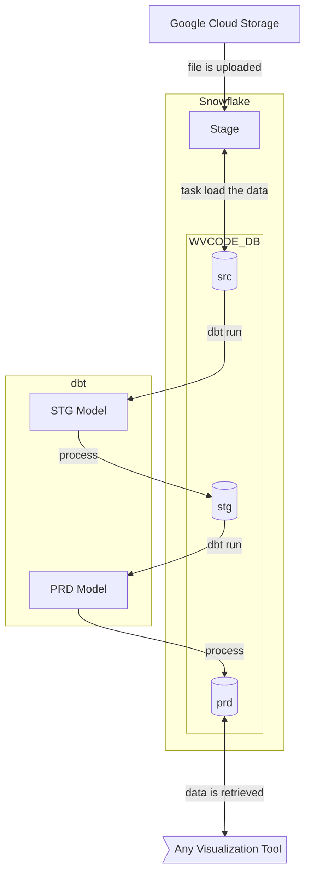

# data-repo-snow

This repository contains datasets for studying data visualization. The data is stored in a Snowflake data warehouse. The datasets were modeled using dbt.

## Objective

The objective of this repository is to serve as a portfolio item to demonstrate skills in data modeling and data analysis using the Snowflake data warehouse. In the following sections, we will describe what has been done in this repository.

## Project Architecture

This project is a traditional data warehouse project, where we include the processes of extraction, loading, and transformation (ELT paradigm), ultimately generating tables ready to be used by analysts to produce visualizations.

The project structured the warehouse into 3 layers, following the ***Medallion Architecture*** pattern:
- **src (Bronze)**: where the data is loaded directly from the files, without any transformation
- **stg (Silver)**: where the data is processed and transformed, but is not yet ready to be consumed
- **prd (Gold)**: where the data is ready to be consumed

We used the dbt tool for data transformation, ensuring that our entire project is based on SQL code, allowing us to version the code and ensure its quality.

The architecture can be visualized in the diagram below:

## Technologies Used

The following technologies were used:
- Snowflake Data Warehouse for data storage
- Snowflake Scripting for creating procedures, tasks, and stages
- dbt (version 1.8.3) for data modeling, using the dbt-core and dbt-snowflake components
- Python to use dbt
- Github to store the code
- Google Cloud Storage to temporarily store datasets in files for loading into the warehouse

## Snowflake - Setup and Implementation Details

The data warehouse was configured as follows:
- A warehouse called WVCODE_WH, with an X-Small size, for processing tasks, procedures, and queries
- A database called WVCODE_BD with 4 schemas:
  - public: to store procedures, stages, tasks, and other objects
  - src: to represent the bronze layer
  - stg: to represent the silver layer
  - prd: to represent the gold layer

With this basic configuration, let’s move on to the implementation details. The object creation scripts are in the `sf_scripts` folder.

### Stage WVCODE_STAGE

We created an External Stage in the public schema that connects to Google Cloud Storage, where we upload the files.

### Task Load_File_Task

We created a task that runs every 30 minutes, calling a procedure that checks if a file is present in the stage, then infers the file’s data structure, creates the corresponding table in the src schema, and loads the data. If the execution completes without errors, the file is removed from the stage.

### File Format WVCODE_CSV and WVCODE_CSV_0

We created two file formats, one for CSV files with a header and another for CSV files without a header. The format with a header is used to infer the structure of the files, while the format without a header is used to load the data.

## dbt - Setup and Implementation Details

dbt was used for data modeling. dbt is an open-source data modeling tool that allows analysts and data engineers to transform data into insights. dbt allows you to write SQL transformations in .sql files and then run those files to create tables and views in your data warehouse.

We used the standard project structure and made some additional configurations so that it could be stored on GitHub. See the configurations made below:

### Macro generate_schema_name

We created this macro to ensure that the default schema from the connection configuration is not added as a prefix to the schemas created according to the project’s standard.

### Connection File profiles.yml

We created a connection file `profiles.yml` to store connection information to Snowflake. This file uses environment variables that must be present in a `.env` file.

## Contact

For more information, contact me by email: [Walter](mailto:wpcortes@gmail.com)
